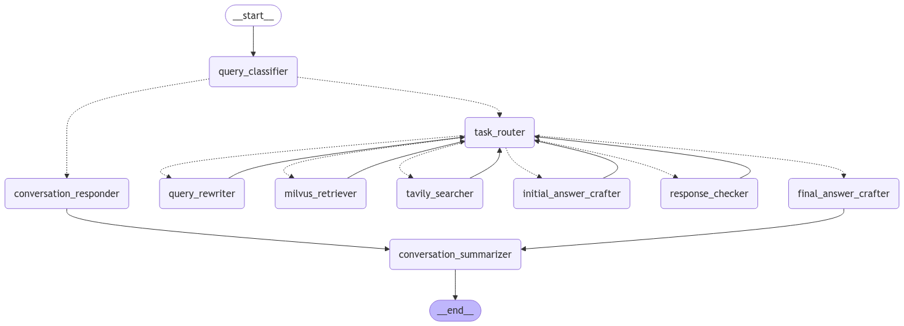

# Multi-Agent Agentic RAG (Local)


## Prerequisites

Ensure you have the following installed on your machine:
- Docker Desktop (required for Magic-PDF and vLLM)
- Conda (for creating and managing environments)

## Project Setup

Follow these steps to set up the development environment for this project.

Note: magic-pdf explicitly required transformers==4.42.4 to work and the project required an updated transformers version, hence, creating different containers with different environments.

### 1. *Create conda environment*
```bash
conda create -n agentic_rag python=3.10
conda activate agentic_rag
```

### 2. *Install PyTorch with CUDA Compatibility*
```bash
pip install torch==2.5.0 torchvision==0.20.0 torchaudio==2.5.0 --index-url https://download.pytorch.org/whl/cu124
```

### 3. *Install requirements*
```bash
pip install -r requirements.txt
```

### 4. *Create a .env file containing:*
- **HF_TOKEN_WRITE** - Create write access huggingface token at [here](https://huggingface.co/security-checkup?next=%2Fsettings%2Ftokens)
- **HF_TOKEN_READ** - Create read access huggingface token at [here](https://huggingface.co/security-checkup?next=%2Fsettings%2Ftokens)
- **TAVILY_API_KEY** - Get your api key at [here](https://tavily.com/)
- **VLLM_API_KEY** - Create a preferred key

### 5. *Download model from huggingface*
```bash
python download_huggingface_model.py
```

### 6. *Configure docker-compose.yml file for vLLM parameters*
- **volumes:** Change the path to the downloaded model directory that contains config.json
- **--api-key:** Change it according to the *VLLM_API_KEY* defined in *Step 4*

### 7. *Build and start the Docker containers using `docker-compose` file*
- **Ensure is in root directory to build for the main project**
```bash
 docker-compose up --build -d
```

### 8. *Clear cache after everything installed successfully*
- **Environment**
```bash
pip cache purge
conda clean --all -y
```
- **Docker**
```bash
docker builder prune 
```