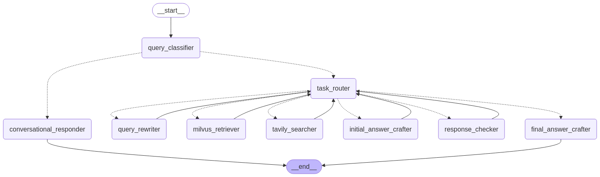

# Multi-Agent Agentic RAG (Local)
**Version 1.0.0**  
A multi-agent Retrieval-Augmented Generation (RAG) system that runs locally using vLLM and other AI components.  

**Main Model :- [Qwen/Qwen2.5-14B-Instruct-AWQ](https://huggingface.co/Qwen/Qwen2.5-14B-Instruct-AWQ)**



---

## **Prerequisites**
Ensure you have [Docker Desktop](https://www.docker.com/products/docker-desktop/) installed on your machine.  

---

## **Project Setup**
Follow these steps to set up the development environment for this project.  

### **1. Create a `.env` file and define the following variables:**
```ini
HF_TOKEN_WRITE=your_huggingface_write_token
HF_TOKEN_READ=your_huggingface_read_token
TAVILY_API_KEY=your_tavily_api_key
VLLM_API_KEY=your_preferred_vllm_api_key
```
- **HF_TOKEN_WRITE** – Create a write-access Hugging Face token [here](https://huggingface.co/settings/tokens).  
- **HF_TOKEN_READ** – Create a read-access Hugging Face token [here](https://huggingface.co/settings/tokens).  
- **TAVILY_API_KEY** – Get your API key [here](https://tavily.com/).  
- **VLLM_API_KEY** – Define a preferred key for vLLM authentication.  

---

### **2. Configure `docker-compose.yml` for vLLM parameters**
- Modify the `--api-key` field to match the `VLLM_API_KEY` defined in **Step 1**.  

---

### **3. Build and Start the Docker Containers**
Ensure you are in the root directory before executing the following command:  
```bash
docker-compose up --build -d
```

---

### **4. Clear Cache After Installation**
After successful installation, you can clear Docker cache to free up space:  
```bash
docker builder prune
```

---

## **Stopping and Removing Containers**
To stop the running containers:  
```bash
docker-compose down -v
```
To remove all stopped containers, networks, and volumes:  
```bash
docker system prune -a
```

---

## **Troubleshooting**
### ❌ **Docker container fails to start**  
- Run `docker-compose logs` to check for errors.  
- Ensure your `.env` file is properly configured.  

### ❌ **Port conflicts**  
- Check if the required ports are already in use by running:  
  ```bash
  netstat -anp | grep LISTEN
  ```
- Modify `docker-compose.yml` to use a different port if needed.  

---